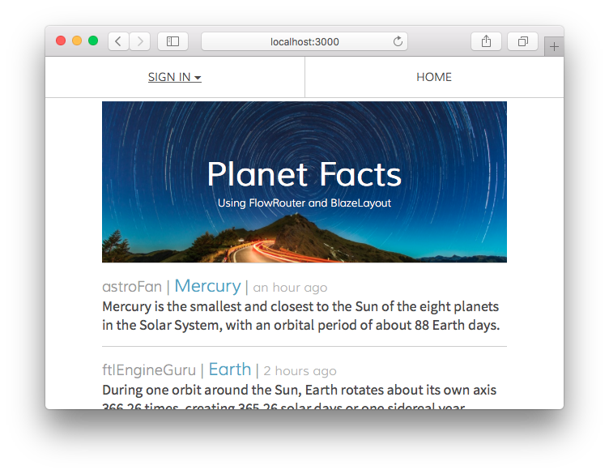

---

## Planet Facts

Share facts about your favorite planets.

A simple app to understand the basics of routing in Meteor using FlowRouter. To run this app make sure you have Meteor [installed](https://www.meteor.com/install).

## To Run Locally

In your terminal check to make sure meteor, node, and npm are installed.
```bash
$ meteor --version && node --version && npm --version
```

Change into a directory where you want to clone the project.
```bash
$ cd ~/Desktop
```

Clone the project from github.
```bash
$ git clone https://github.com/griffinsockwell/meteor-flowrouter-blaze.git
```

Change into the project directory.
```bash
$ cd meteor-flowrouter-blaze
```

Install the node modules.
```bash
$ npm install
```

There is a script in package.json to start the meteor server.
```bash
$ npm start
```

App running at: [http://localhost:3000/](http://localhost:3000/)

---

## License

The MIT License (MIT)

Copyright (c) 2016 Griffin Sockwell

Permission is hereby granted, free of charge, to any person obtaining a copy of this software and associated documentation files (the "Software"), to deal in the Software without restriction, including without limitation the rights to use, copy, modify, merge, publish, distribute, sublicense, and/or sell copies of the Software, and to permit persons to whom the Software is furnished to do so, subject to the following conditions:

The above copyright notice and this permission notice shall be included in all copies or substantial portions of the Software.

THE SOFTWARE IS PROVIDED "AS IS", WITHOUT WARRANTY OF ANY KIND, EXPRESS OR IMPLIED, INCLUDING BUT NOT LIMITED TO THE WARRANTIES OF MERCHANTABILITY, FITNESS FOR A PARTICULAR PURPOSE AND NONINFRINGEMENT. IN NO EVENT SHALL THE AUTHORS OR COPYRIGHT HOLDERS BE LIABLE FOR ANY CLAIM, DAMAGES OR OTHER LIABILITY, WHETHER IN AN ACTION OF CONTRACT, TORT OR OTHERWISE, ARISING FROM, OUT OF OR IN CONNECTION WITH THE SOFTWARE OR THE USE OR OTHER DEALINGS IN THE SOFTWARE.
